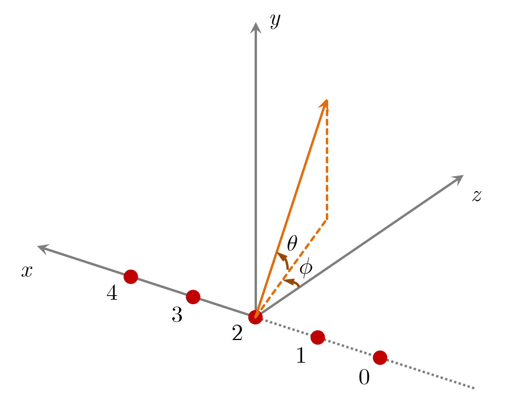

# jam_echo_gen

为挑战赛问题一提供标准化的含噪声与干扰的 A/D 数据仿真生成函数。

## 安装

首先检查机器是否满足安装要求。当前支持的操作系统、CPU 架构和 Python 版本如下：

|         |      Windows      |    Linux (GNU)    |        macOS      |
| :-----: | :---------------: | :---------------: | :---------------: |
| x86_64  | 3.8<=python<=3.11 | 3.8<=python<=3.11 | 3.8<=python<=3.11 |
| aarch64 |                   | 3.8<=python<=3.11 |                   |
<!-- Linux (MUSL): 3.9<=python<=3.12  -->

> 最终的统一验证平台系统环境为 Ubuntu aarch64, conda 23.5.0 (Python 3.9)。

根据开发环境的系统配置，选择适用的 .whl 文件，运行如下命令即可完成安装：

```shell
pip install jam_echo_gen-0.1.0-cp<pyver>-cp<pyver>-<os>_<arch>.whl
```

该过程将自动安装依赖的软件包（需要联网）。

## 使用方法

本包提供公开的函数接口 `echo_gen` ，用于为算法测试与评估生成一维等间距线阵接收到的带干扰与噪声的多通道数据。

### 仿真约定

对于数据生成过程中使用的仿真模型，约定：

- 一维等间距线阵的子阵间距等于半波长；
- 子阵编号与方位角、俯仰角的定义如下图所示，其中子阵编号从 0 开始连续计数，方位角 $\phi$ 和俯仰角 $\theta$ 的取值范围均为 $(-\pi / 2, \pi / 2)$。
<div align=center>
  
</div>

### 函数接口说明

函数 `echo_gen` 的签名如下：

```python
def echo_gen(case: int, num_subarrays: int, num_targets: int, num_jams: int) -> tuple
```

其中，输入参数说明如下：

1. `case`：测试场景类别编号（可选值： 0, 1, 2, 3）。各类别含义请见[测试场景类别说明](###测试场景类别说明)；
2. `num_subarrays`：仿真的一维均匀等间距线阵所包含的子阵个数，每个子阵下行一个通道的数据。取值不能过小，否则会抛出异常。实际可接受的最小子阵数请见异常信息；
4. `num_targets`：场景中的目标个数（取值范围：>= 0）；
4. `num_jams`：场景中的干扰个数（取值范围：>= 0）。

返回值为由如下对象组成的元组：

1. `freq`：载波频率（单位为 Hz）；
2. `target_azim`：目标方位角（单位为 rad，取值范围为  $(-\pi/2, \pi/2)$）；
3. `noise_power`：噪声功率（单位为 W）；
4. `signal`：仿真生成的采样信号，类型为复数 `np.ndarray`，形状为 `(num_working_subarrays, num_range_gates)`。其中：
    - `num_working_subarrays` 为实际工作的子阵个数，取值范围为 `[int(num_subarrays/2), num_subarrays]`，实际值与 `case` 有关，详见[测试场景类别说明](###测试场景类别说明)；
    - `num_range_gates` 为采样的距离门个数，取值与 `case` 有关，详见[测试场景类别说明](###测试场景类别说明)；
5. `working_subarrays`：实际工作的子阵编号数组，类型为整数 `np.ndarray`，形状为 `(num_working_subarrays,)`，各元素互异且取值范围为 `[0, num_subarrays)`，与 `signal` 的行下标一一对应，即 `signal[working_subarrays[i], i_gate]` 表示第 `i` 个工作子阵（在全阵中的编号为 `working_subarrays[i]`）采样得到的多通道数据。

### 测试场景类别说明

`echo_gen` 共覆盖四类测试场景，它们的含义如下表所示：

|     类别    |    含义    |
| :---------: | :--------- |
| 0 | 距离门个数 = 3×子阵数 <div>仅在区间 `[0, num_subarrays)` 内的距离单元上随机设置目标</div> |
| 1 | 距离门个数 = 3×子阵数 <div>在所有距离单元上随机设置目标</div> |
| 2 | 距离门个数 = 子阵数 <div>在所有距离单元上随机设置目标</div> |
| 3 | 距离门个数 = 3×子阵数 <div>仅在区间 `[0, num_subarrays)` 内的距离单元上随机设置目标</div> <div> 部分接受通道随机失效（工作通道数目取值范围：`[int(num_subarrays/2), num_subarrays-1]`）</div> |